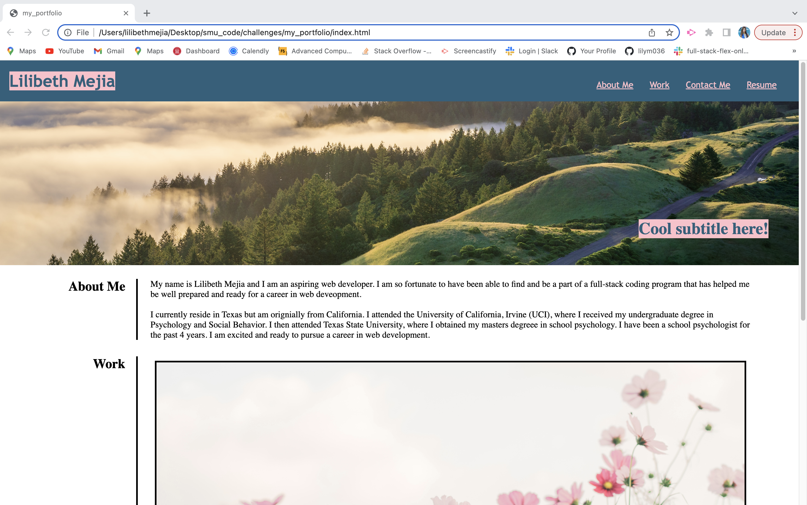

# My_Portfolio

## Description
This project was created to allow potential employers to review a candidate's samples of their work and assess whether they're a good candidate for an open position. An employer is able to do this by viewing a candidates deployed portfolio of work samples. 

## Installation
N/A

## Usage
Open index.html file in the browser. Click on the "About Me, "Work," "Contact Me," or "Resume" tabs on the top right corner to read about each section.

https://lilym036.github.io/my_portfolio/#

## Credits
Meg Meyers- Tutor

## License
MIT License

Copyright (c) 2023 Lilibeth Mejia

Permission is hereby granted, free of charge, to any person obtaining a copy
of this software and associated documentation files (the "Software"), to deal
in the Software without restriction, including without limitation the rights
to use, copy, modify, merge, publish, distribute, sublicense, and/or sell
copies of the Software, and to permit persons to whom the Software is
furnished to do so, subject to the following conditions:

The above copyright notice and this permission notice shall be included in all
copies or substantial portions of the Software.

THE SOFTWARE IS PROVIDED "AS IS", WITHOUT WARRANTY OF ANY KIND, EXPRESS OR
IMPLIED, INCLUDING BUT NOT LIMITED TO THE WARRANTIES OF MERCHANTABILITY,
FITNESS FOR A PARTICULAR PURPOSE AND NONINFRINGEMENT. IN NO EVENT SHALL THE
AUTHORS OR COPYRIGHT HOLDERS BE LIABLE FOR ANY CLAIM, DAMAGES OR OTHER
LIABILITY, WHETHER IN AN ACTION OF CONTRACT, TORT OR OTHERWISE, ARISING FROM,
OUT OF OR IN CONNECTION WITH THE SOFTWARE OR THE USE OR OTHER DEALINGS IN THE
SOFTWARE.

